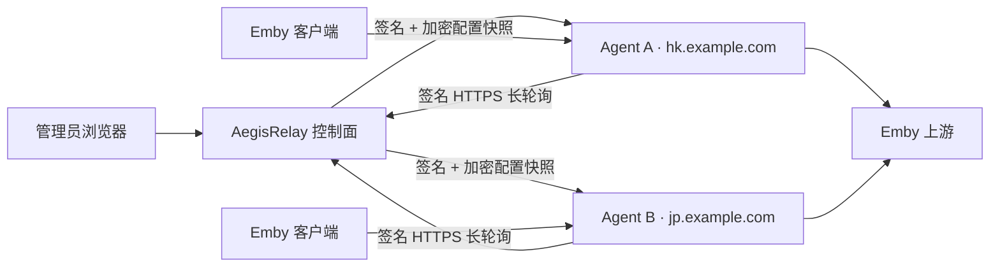
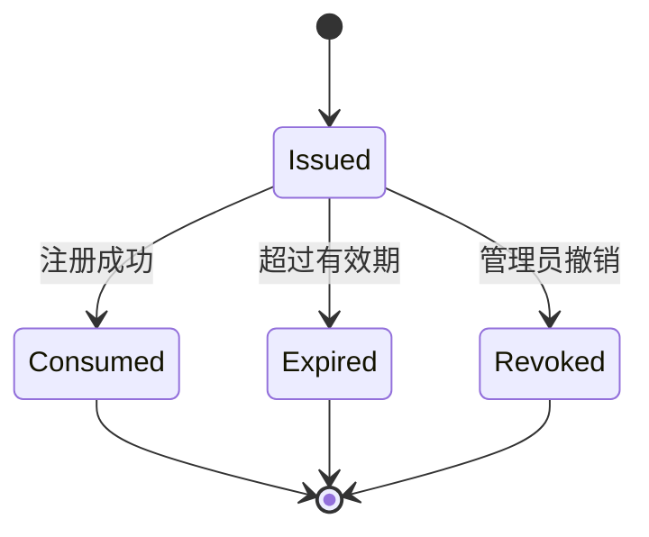
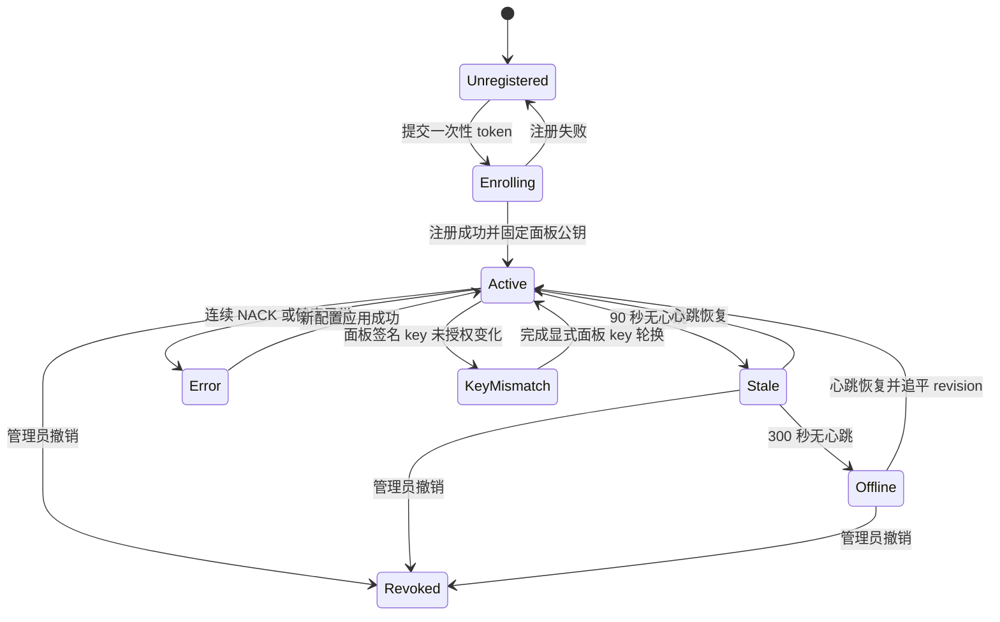
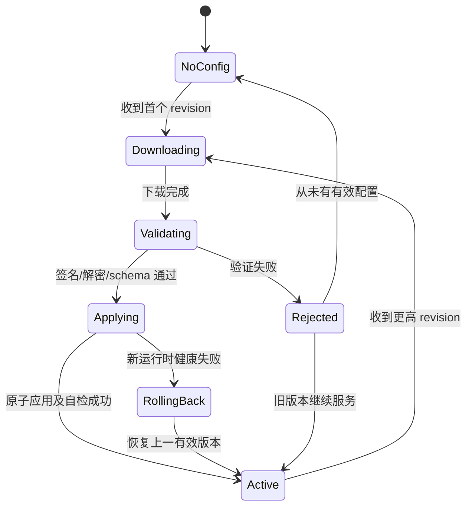
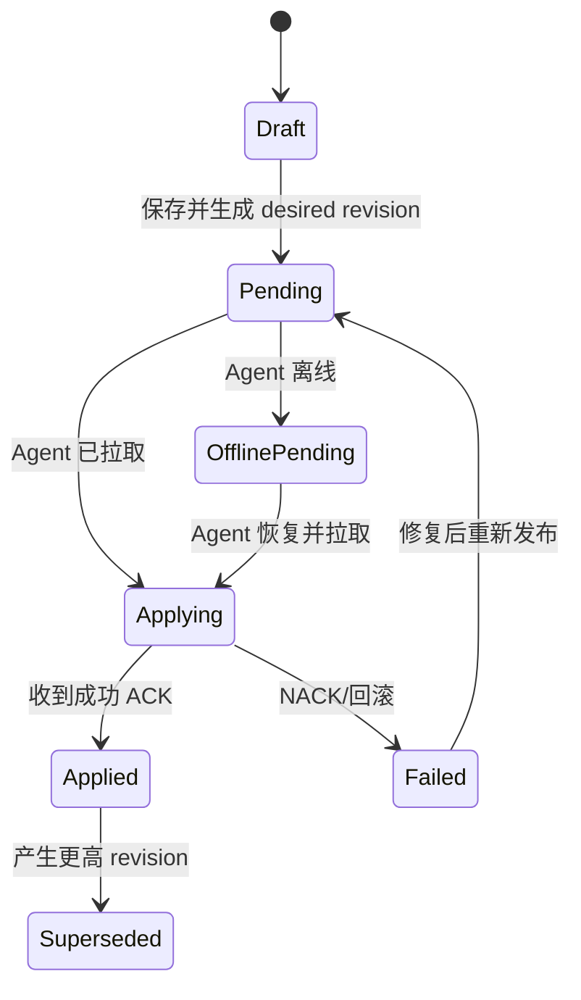
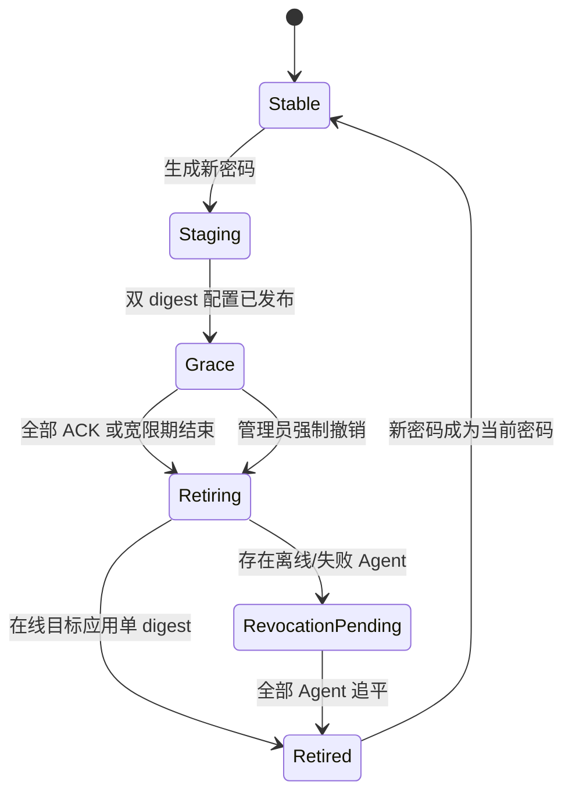

# AegisRelay Agent 协议与状态机

状态：已实现（协议版本 `1`，AegisRelay `0.7.0`）  
适用版本：控制面 / Agent 分离的首个实现  
兼容目标：保留现有单机部署，并将本机视为一个内嵌 Agent

## 0. 实现状态

Phase 1 已落地：

- Store schema v1/v2 会在启动时原子迁移到 schema v3，并在同目录保留对应旧版本的加密备份；
- 可恢复的老节点保持原访问密码和客户端路径不变，改用独立 256 位 `routeAuthKey`；
- 只剩旧摘要、无法恢复密码的节点继续由本机兼容数据面服务，并在管理员轮换密码前禁止进入 Agent 快照；
- 快照使用固定 canonical JSON、单调 revision、SHA-256 hash 和 Ed25519 签名；内容未变化时不会制造新 revision；
- 当前机器自动注册为“本地 Agent”，通过环回执行拉取、验签、原子应用和 ACK；
- 本地 Agent 当前/上一份快照使用独立存储密钥 AES-256-GCM 加密，控制面配置失败不会覆盖当前有效运行时；
- 代理运行时通过原子只读配置指针取路由，配置切换不会修改正在播放请求所持有的旧对象。

Phase 2 已落地：

- Store schema v3 新增独立的 Agent 注册表和 `Deployment（Route × Agent）` 关系；
- 升级时会为所有现有节点自动创建本地 Deployment，本地签名快照的内容、hash 和 signature 保持不变；
- 快照编译器可以按 Agent 只选择已部署节点；
- 面板可以修改机器域名和节点选择，远程机器失联后会保留，只有管理员确认后才从面板删除。
- 面板可以生成只显示一次、10 分钟有效的 enrollment token，控制面只保存 SHA-256 摘要；
- 远程 Agent 可以通过一键脚本生成 Ed25519/X25519 身份、完成 TOFU 注册并发送带 timestamp + nonce 的签名心跳；
- 面板响应绑定请求 nonce 并使用固定的 Ed25519 面板身份签名，重复 nonce 会被拒绝；
- 安装脚本不会把 enrollment token 写入持久配置，并提供 `sudo aegis-relay-agent uninstall`；卸载后控制面记录按设计保持失联。
- Agent 通过签名轮询读取目标 revision；配置使用临时 X25519 密钥协商、HKDF-SHA256 和 AES-256-GCM 针对单台机器加密，并由面板 Ed25519 身份再次签名；
- Agent 验证面板响应、信封签名、接收者身份、AEAD、明文 hash 和快照签名后，才会原子替换当前运行配置并发送 ACK/NACK；
- 当前与上一份快照使用 Agent 独立存储密钥加密落盘，面板离线或新配置被拒绝时继续运行最后一份有效配置；
- Agent 在 `127.0.0.1:8080` 提供实际 Emby 代理数据面，可由本机 Nginx + Let's Encrypt 向导发布为 HTTPS 域名；
- `0.5.0` 已注册 Agent 可使用 `agent-upgrade.sh` 就地升级，原注册身份不会变化。
- Let's Encrypt 联系邮箱在控制面加密存储并统一管理，enrollment 命令由控制面自动注入；每台机器不再单独录入邮箱。
- `telemetry-v1` 将逐节点请求、播放、上下行字节、月度字节、错误、活动连接和最近 31 天日流量放入已签名的 check-in；控制面只接受有界计数并重新计算总量。Agent 每 60 秒使用本机独立存储密钥加密落盘，长播放按数据块持续计数。

25 秒服务端挂起式长轮询和更细粒度运行指标仍是后续优化；当前 15 秒签名轮询不影响配置正确性或离线播放能力。

## 1. 目的

本文定义 AegisRelay 从“单机管理面板 + 代理”演进为“中心控制面 + 多机 Agent 数据面”时的信任模型、通信协议、配置格式、状态机、失败处理和安全边界。

目标是让管理员只配置一次 Emby 节点，再选择部署到哪些代理机器。各机器使用自己的域名，但节点别名和访问密码保持一致：

```text
https://hk.example.com/charity/<相同访问密码>/
https://jp.example.com/charity/<相同访问密码>/
```

本文中的“必须”“禁止”“应当”“可以”分别对应 MUST、MUST NOT、SHOULD、MAY。

## 2. 设计原则

1. Agent 只主动连接控制面，不开放入站管理端口。
2. 控制面不位于播放数据路径；控制面离线时，Agent 继续使用最后一份有效配置。
3. `APP_MASTER_KEY`、管理员密码、TOTP、恢复码、会话和通知凭据禁止下发给 Agent。
4. Agent 只能接收声明式代理配置；协议不提供任意 Shell、文件写入或远程 root 命令。
5. 配置必须经过面板签名、针对指定 Agent 加密，并带单调递增 revision。
6. Agent 请求必须签名，并使用 timestamp + nonce 防止重放。
7. 配置应用必须幂等、可验证、原子切换，并保留上一份有效版本用于回滚。
8. 单台 Agent 被攻陷时，不应暴露其他 Agent、未分配节点或控制面的主密钥。
9. v1 配额按 Agent 独立执行；控制面汇总仅用于展示。

## 3. 非目标

v1 不实现：

- 任意远程命令执行；
- 集中持有 DNS 服务商或 Cloudflare API Token；
- 全局强一致流量配额；
- 多管理员 RBAC；
- Agent 自动升级；
- 控制面高可用共识；
- 在 Agent 永久离线时仍保证立即撤销其本地旧访问密码。

最后一项是可用性与强撤销之间的固有冲突，详见“访问密码轮换”。

## 4. 总体架构



### 4.1 控制面

控制面负责：

- 管理员认证和 2FA；
- Agent 注册、撤销和在线状态；
- 全局 Emby 节点定义；
- 节点到 Agent 的部署关系；
- 为每台 Agent 编译不可变配置快照；
- 签名并加密快照；
- 接收应用回执和聚合指标；
- 编排访问密码轮换。

### 4.2 Agent

Agent 负责：

- 主动注册、心跳和长轮询；
- 验证控制面签名；
- 解密、验证并原子应用配置；
- 运行现有代理、播放流量接管、故障转移、限速和本地配额逻辑；
- 保存当前和上一份有效快照；
- 批量上报不含敏感 URL 的指标；
- 控制面不可用时继续服务。

Agent 不承载管理员页面，不接受来自控制面的任意命令。

### 4.3 运行模式

| 模式 | 行为 |
|---|---|
| `standalone` | 保持现有部署；同一进程运行控制面和本地数据面 |
| `control` | 仅运行管理 UI、Agent API 和配置编译器 |
| `agent` | 仅运行数据面和出站控制客户端 |

现有安装升级后默认仍为 `standalone`，不得要求用户重新创建管理员、节点或访问密码。

## 5. 身份与密钥

### 5.1 控制面密钥

控制面新增独立 Ed25519 配置签名密钥对：

- `panelSigningPrivateKey`：使用现有 `APP_MASTER_KEY` 加密保存，只留在控制面；
- `panelSigningPublicKey`：Agent 注册成功时通过 TOFU 固定；
- `panelKeyId`：公钥 SHA-256 指纹的前 16 字节，使用 base64url 表示。

`APP_MASTER_KEY` 只用于控制面静态数据加密，禁止作为 Agent 请求认证、路由验证或配置签名密钥直接使用。

### 5.2 Agent 密钥

Agent 首次启动必须本地生成两组密钥：

- Ed25519：签署心跳、轮询、回执和指标请求；
- X25519：接收仅属于该 Agent 的加密配置。

私钥以 `0600` 权限保存在 Agent 数据目录，禁止写入日志、命令行、安装输出或控制面。

### 5.3 节点访问验证密钥

每个 Emby 节点新增随机 32 字节 `routeAuthKey`。访问密码验证值为：

```text
HMAC-SHA256(routeAuthKey, UTF8(accessKey))
```

控制面只向被分配该节点的 Agent 下发该节点的 `routeAuthKey` 和有效 digest 集合。不得下发 `APP_MASTER_KEY`。

Agent 被攻陷后可能读取分配给它的节点验证材料；这是数据面必须验证客户端密码带来的剩余风险。每节点独立密钥可阻止该风险扩散到未分配节点。

### 5.4 旧节点迁移

- 如果控制面仍保存可恢复的 `accessKey`，升级时生成 `routeAuthKey` 并重新计算 digest；
- 只保存旧 HMAC digest、无法恢复访问密码的节点必须先轮换密码，才可部署到远程 Agent；
- 迁移不得改变已经可恢复的客户端地址。

## 6. 编码与密码学约定

- 哈希：SHA-256；
- 请求/配置签名：Ed25519；
- 密钥协商：X25519；
- 密钥派生：HKDF-SHA256；
- 配置加密：AES-256-GCM，12 字节随机 IV；
- 二进制字段：无填充 base64url；
- 时间：UTC Unix 秒；
- 标识符：至少 128 位随机值的 base64url；
- revision：JSON 安全整数范围内的正整数，按 Agent 单调递增。

协议禁止依赖普通 JSON 对象键顺序进行验签。配置等需要独立保存签名的对象必须携带 base64url 编码的原始 payload，签名直接覆盖该 payload。HTTP 请求和响应则使用下文定义的逐行规范串。

## 7. Agent API

API 根路径：

```text
/api/agent/v1
```

所有响应使用 `application/json`，但 `204 No Content` 除外。请求体上限默认 256 KiB，指标批次上限默认 1 MiB。

### 7.1 端点

| 方法 | 路径 | 用途 |
|---|---|---|
| `POST` | `/enroll` | 使用一次性 token 注册 |
| `POST` | `/check-in` | 心跳、版本和应用状态 |
| `GET` | `/config?after=<revision>&wait=25` | 长轮询新配置 |
| `POST` | `/ack` | 配置应用成功或失败回执 |
| `POST` | `/metrics` | 批量指标上报 |
| `POST` | `/panel-key/confirm` | 面板签名公钥轮换确认，预留 |

除 `/enroll` 外，所有请求必须使用 Agent 签名认证。除 `204` 外，所有响应必须带面板签名。

## 8. 一次性注册

### 8.1 注册 token

控制面生成至少 256 位随机 token：

- 默认有效期 10 分钟；
- 只能成功使用一次；
- 控制面只保存 SHA-256(token)；
- 可在使用前撤销；
- 与可选的预设 Agent 名称绑定；
- 成功注册和消费 token 必须是同一原子操作。

安装命令中的 token 可能短暂出现在 Shell 历史和进程参数中，因此 token 必须短时、单次，并在注册后立即失效。面板不得再次显示原 token。

### 8.2 注册请求

```http
POST /api/agent/v1/enroll
Content-Type: application/json
```

```json
{
  "protocolVersion": 1,
  "token": "single-use-secret",
  "agent": {
    "name": "Hong Kong 01",
    "signPublicKey": "base64url-ed25519-public-key",
    "boxPublicKey": "base64url-x25519-public-key",
    "agentVersion": "0.4.0",
    "capabilities": ["proxy-v1", "metrics-v1", "dual-key-v1"]
  },
  "machine": {
    "hostname": "relay-hk-01",
    "architecture": "x64",
    "platform": "linux"
  }
}
```

不得上报公网 IP 之外的网卡列表、环境变量、进程列表、SSH 信息或其他非必要主机数据。

### 8.3 注册响应

```json
{
  "protocolVersion": 1,
  "agentId": "agent-random-id",
  "panelKeyId": "panel-key-fingerprint",
  "panelSigningPublicKey": "base64url-ed25519-public-key",
  "serverTime": 1784563200,
  "poll": {
    "path": "/api/agent/v1/config",
    "maxWaitSeconds": 25,
    "heartbeatSeconds": 30
  }
}
```

Agent 通过有效 HTTPS 连接和一次性 token 对该响应执行 TOFU，随后固定 `panelKeyId` 和公钥。之后如果公钥无授权地变化，Agent 必须拒绝配置并进入 `panel_key_mismatch` 状态。

### 8.4 一键安装命令

面板可以生成：

```bash
curl -fsSL https://panel.example.com/agent-install.sh | sudo sh -s -- \
  --panel https://panel.example.com \
  --token <一次性注册令牌> \
  --name '香港 01' \
  --domain hk.example.com \
  --email admin@example.com
```

管理员不会在每台机器上填写 `--email`；控制面从加密保存的统一证书邮箱自动生成完整命令。该参数只作为安装器接收控制面配置的协议字段。

安装脚本只能执行固定流程：安装运行依赖、创建非 root Agent 用户和数据目录、生成本机密钥、注册、配置本机 Nginx/证书并启动服务。它不得从控制面接收或执行任意命令。

- `--panel` 必须为无 URL 凭据的 HTTPS origin；
- token 禁止放在 URL 查询参数中；
- 注册成功后不得把 token 写入 `.env`、配置文件或日志；
- 安装输出只显示 agentId、域名和注册结果；
- DNS 尚未指向本机时允许先完成注册，但状态必须为 `domain_pending`，且不得声称 HTTPS 已就绪；
- 生产版本应使用带校验和或签名的固定版本安装制品，不能永久依赖可变的 `main` 分支内容。

## 9. Agent 请求签名与重放防护

### 9.1 请求头

```text
X-Aegis-Agent-Id: <agentId>
X-Aegis-Timestamp: <unix-seconds>
X-Aegis-Nonce: <128-bit-random-base64url>
X-Aegis-Content-SHA256: <body-sha256-base64url>
X-Aegis-Signature: <ed25519-signature-base64url>
```

无请求体时，内容哈希仍必须为 SHA-256 空字节串。

### 9.2 签名输入

```text
AegisRelay-Agent-Request-v1
<UPPERCASE_METHOD>
<PATH_AND_CANONICAL_QUERY>
<AGENT_ID>
<TIMESTAMP>
<NONCE>
<CONTENT_SHA256>
```

以上各行使用 UTF-8 编码并以单个 LF（`0x0a`）连接，最后一行后不追加 LF。

查询参数按键名、值的 UTF-8 字节升序排列并进行 RFC 3986 百分号编码。禁止在代理或框架层验证签名前改写路径。

### 9.3 验证规则

控制面必须按以下顺序处理：

1. 检查 Agent 存在且未撤销；
2. 检查 timestamp 与服务端时间偏差不超过 300 秒；
3. 检查请求体哈希；
4. 使用登记的 Agent Ed25519 公钥验签；
5. 以原子“若不存在则插入”操作占用 `(agentId, nonce)`；最近 10 分钟出现过则拒绝；
6. nonce 占用成功后才处理业务。

nonce 缓存可以批量持久化；进程重启后的短暂重放窗口属于已知风险。具有状态改变作用的 `/ack` 和 `/metrics` 仍必须通过 revision、configId、bootId 和 seq 实现业务级幂等。

## 10. 面板响应签名

面板响应使用以下头：

```text
X-Aegis-Panel-Key-Id: <panelKeyId>
X-Aegis-Timestamp: <unix-seconds>
X-Aegis-Content-SHA256: <body-sha256-base64url>
X-Aegis-Signature: <ed25519-signature-base64url>
```

签名输入：

```text
AegisRelay-Panel-Response-v1
<HTTP_STATUS>
<REQUEST_NONCE>
<TIMESTAMP>
<CONTENT_SHA256>
```

以上各行同样以单个 LF 连接，最后一行后不追加 LF。

Agent 必须使用注册时固定的面板公钥验证响应，并确认响应绑定了原请求 nonce。失败时禁止应用配置。

## 11. 心跳与长轮询

### 11.1 Check-in

Agent 默认每 30 秒发送：

```json
{
  "protocolVersion": 1,
  "agentVersion": "0.4.0",
  "bootId": "random-per-process-start",
  "uptimeSeconds": 3600,
  "currentRevision": 42,
  "currentConfigId": "config-id",
  "applyState": "active",
  "proxyHealthy": true,
  "domain": "hk.example.com",
  "certificateNotAfter": "2026-10-19T00:00:00Z",
  "capabilities": ["proxy-v1", "metrics-v1", "dual-key-v1"]
}
```

控制面响应当前 `desiredRevision`、建议轮询间隔和服务器时间。心跳不得包含节点地址、访问密码、请求 URL、Emby Token 或客户端 IP。

### 11.2 配置长轮询

```http
GET /api/agent/v1/config?after=42&wait=25
```

- 无新配置时返回 `204`；
- 有新配置时返回 `200` 和配置加密信封；
- `wait` 最大 25 秒；
- 中间代理超时必须高于 35 秒；
- 同一 Agent 默认只允许一个活动长轮询；新的轮询可替换旧连接。

### 11.3 退避

网络失败使用带随机抖动的指数退避：2 秒、4 秒、8 秒，最大 5 分钟。成功 check-in 后重置退避。Agent 不得因控制面不可达停止代理。

## 12. 配置模型

### 12.1 控制面数据关系

```text
Route（全局 Emby 节点）
  └── Deployment（Route × Agent）
        └── per-agent overrides

Agent
  └── Desired Config Snapshot（该 Agent 所有 Deployment 的编译结果）
```

别名和访问密码属于全局 Route，在所有部署机器上一致。以下字段可以按 Deployment 覆盖：

- 主上游；
- 播放上游；
- 私网回源；
- TLS 验证；
- 播放流量接管；
- 限速和单机配额；
- 客户端兼容请求头。

### 12.2 明文配置快照

```json
{
  "schemaVersion": 1,
  "agentId": "agent-random-id",
  "configId": "config-random-id",
  "revision": 43,
  "issuedAt": 1784563200,
  "minimumAgentVersion": "0.4.0",
  "routes": [
    {
      "id": "route-id",
      "alias": "charity",
      "name": "Charity",
      "enabled": true,
      "upstreams": ["https://origin.example.com"],
      "allowPrivate": false,
      "tlsVerify": true,
      "showOnHome": false,
      "clientProfile": {"enabled": false},
      "streamRewrite": {"enabled": false, "domains": []},
      "speedLimitMbps": 0,
      "monthlyQuotaGB": 0,
      "access": {
        "mode": "key",
        "algorithm": "hmac-sha256-v1",
        "routeAuthKey": "base64url-32-random-bytes",
        "accepted": [
          {
            "keyId": "current-key-id",
            "digest": "base64url-hmac",
            "notBefore": 1784563200,
            "notAfter": null
          }
        ]
      }
    }
  ]
}
```

配置不得包含管理员数据、Agent 私钥、面板私钥、`APP_MASTER_KEY`、Telegram Token、审计记录或其他 Agent 信息。

## 13. 配置加密信封

控制面为每个快照生成临时 X25519 密钥对，与 Agent 的固定 X25519 公钥执行 ECDH，再使用：

```text
HKDF-SHA256(
  ikm = sharedSecret,
  salt = SHA256("AegisRelay-Config-v1"),
  info = UTF8(agentId + ":" + revision),
  length = 32
)
```

派生 AES-256-GCM 密钥。AAD 为：

```text
AegisRelay-Config-AAD-v1\n<agentId>\n<revision>\n<configId>
```

信封外层格式：

```json
{
  "protocolVersion": 1,
  "signedPayload": "base64url-utf8-json-envelope-payload",
  "signature": "base64url-ed25519-signature"
}
```

`signedPayload` 解码后的 JSON 为：

```json
{
  "agentId": "agent-random-id",
  "configId": "config-random-id",
  "revision": 43,
  "panelKeyId": "panel-key-fingerprint",
  "ephemeralBoxPublicKey": "base64url-x25519-public-key",
  "iv": "base64url-12-byte-iv",
  "ciphertext": "base64url-ciphertext",
  "tag": "base64url-gcm-tag",
  "plaintextSha256": "base64url-sha256"
}
```

签名输入为 ASCII 前缀 `AegisRelay-Config-Envelope-v1`、单个 LF 和未经解码的 `signedPayload` 字符串，末尾不追加 LF。Agent 必须先验签，再解码 payload、执行 X25519 和 AES-GCM 解密，最后校验明文哈希和内部字段。这样验签不依赖 JSON 解析器的对象键顺序。

## 14. Agent 配置应用流程

Agent 收到 revision 后必须依次执行：

1. 校验响应签名和面板 keyId；
2. 校验 `agentId` 等于本机身份；
3. 拒绝低于当前 revision 的配置；
4. 对相同 revision，只接受相同 configId 和哈希；
5. 解密并校验 GCM、明文哈希和 schema；
6. 检查 `minimumAgentVersion` 与 capabilities；
7. 验证路由数量、字段长度、别名唯一性和上游 URL；
8. 重新执行 SSRF/DNS、私网和 TLS 策略检查；
9. 写入临时文件并设置 `0600`；
10. 构建候选运行时并执行本地自检；
11. 原子切换当前配置；
12. 保留上一份有效配置；
13. 发送成功 ACK。

任何步骤失败都不得覆盖当前有效配置。失败后发送 NACK，并继续使用旧配置。

### 14.1 本地静态加密

Agent 首次启动另生成本地随机 `agentStorageKey`，用于 AES-256-GCM 加密当前和上一份快照。该密钥只留在 Agent，不由控制面生成或保存。

### 14.2 回滚

回滚必须由以下方式之一触发：

- 新配置应用自检失败时自动保留当前版本；
- 运行新配置后健康检查失败，自动恢复上一份有效版本并 NACK；
- 管理员在控制面选择旧内容，由控制面生成一个更高 revision 的新快照。

Agent 禁止直接应用低 revision，以防止已撤销配置被重放。

## 15. ACK/NACK

```json
{
  "protocolVersion": 1,
  "configId": "config-random-id",
  "revision": 43,
  "status": "applied",
  "appliedAt": 1784563205,
  "activeRevision": 43,
  "activeConfigHash": "base64url-sha256",
  "errorCode": null,
  "errorMessage": null
}
```

失败时 `status` 为 `rejected` 或 `rolled_back`。错误信息必须脱敏，禁止包含完整上游、访问密码、Token、Cookie 或配置明文；最长 240 字符。

ACK 以 `(agentId, configId, revision)` 幂等。重复 ACK 返回成功，不重复写审计记录。

## 16. 指标上报

Agent 指标采用至少一次投递，使用 `(agentId, bootId, seq)` 去重：

```json
{
  "protocolVersion": 1,
  "bootId": "random-per-process-start",
  "seq": 18,
  "periodStart": 1784563140,
  "periodEnd": 1784563200,
  "routes": [
    {
      "routeId": "route-id",
      "requests": 120,
      "playbackRequests": 8,
      "errors": 1,
      "bytesIn": 2048,
      "bytesOut": 104857600,
      "active": 2
    }
  ]
}
```

- 默认每 60 秒或累计 256 条变化后发送；
- Agent 保留未确认批次并重试；
- 控制面响应已确认的最大 seq；
- 不上报请求 URL、访问密码、Emby Token、Cookie 或客户端 IP；
- v1 配额由 Agent 本地独立执行，控制面汇总不参与强制判定。

## 17. 访问密码轮换

### 17.1 默认两阶段流程

1. `stable`：只有当前密码有效；
2. `staging`：生成新密码、keyId 和 digest；
3. 向目标 Agent 下发同时接受新旧 digest 的高 revision；
4. `grace`：记录逐台 ACK，客户端迁移到新地址；
5. 所有目标 Agent 已 ACK，或到达宽限期上限；
6. 生成只接受新 digest 的更高 revision；
7. 在线 Agent ACK 后进入 `retired`。

默认宽限期建议 24 小时，可配置 5 分钟至 7 天。

### 17.2 离线 Agent 的真实语义

“控制面宕机不影响播放”和“离线 Agent 上的旧密码到点立即失效”无法同时严格保证。

默认 `availability-first` 策略：

- 宽限期截止后，控制面对所有目标生成撤销旧密码的新 revision；
- 在线 Agent 立即撤销；
- 离线 Agent 被标记为 `revocation_pending`；
- 离线 Agent 在重新连接并应用新 revision 前，仍可能接受其本地旧密码；
- 面板必须明确显示这段风险窗口，不能声称“全网已经作废”。

可选 `strict-lease` 策略：

- 配置携带面板签名的短期 lease；
- lease 到期且无法续签时，Agent 停止对应节点或停止接受旧 digest；
- 可以获得更强撤销，但控制面长时间不可用会影响播放。

v1 默认实现 `availability-first`；`strict-lease` 作为后续能力，不得默认开启。

### 17.3 强制撤销

管理员可以跳过剩余 ACK 强制进入撤销阶段。面板必须二次确认，并列出离线或失败 Agent。强制撤销不改变上述离线限制。

## 18. 状态机

### 18.1 注册 token



### 18.2 Agent 控制面状态



控制面撤销 Agent 只阻止后续 API 和配置。已经完全离线或被攻陷的 Agent 仍持有最后配置，无法由控制面保证远程擦除；必须通过停机、域名移除、防火墙或本地卸载处理。

### 18.3 Agent 本地配置状态



### 18.4 Deployment 状态



### 18.5 密码轮换状态



## 19. 错误码

| HTTP | errorCode | 含义 |
|---|---|---|
| 400 | `invalid_request` | schema、字段或内容哈希错误 |
| 401 | `invalid_signature` | 签名无效 |
| 401 | `unknown_agent` | Agent 不存在 |
| 403 | `agent_revoked` | Agent 已撤销 |
| 408 | `clock_skew` | timestamp 偏差过大 |
| 409 | `nonce_reused` | nonce 重放 |
| 409 | `revision_conflict` | 相同 revision 对应不同内容 |
| 410 | `enrollment_expired` | 注册 token 过期/已使用 |
| 413 | `payload_too_large` | 请求超过上限 |
| 426 | `upgrade_required` | Agent 或协议版本过旧 |
| 429 | `rate_limited` | 请求频率过高 |
| 503 | `control_unavailable` | 控制面暂时不可用 |

Agent 日志应记录 errorCode、revision 和 configId 的短标识，不记录敏感 payload。

## 20. 在线判定与界面语义

| 状态 | 默认条件 | 面板展示 |
|---|---|---|
| 在线 | 最近心跳 ≤ 90 秒 | 绿色 |
| 延迟 | 90–300 秒 | 黄色 |
| 离线 | > 300 秒 | 灰色 |
| 配置失败 | 最近一次 NACK/回滚 | 红色 |
| 待追平 | appliedRevision < desiredRevision | 蓝色/黄色 |
| 待撤销 | 离线且仍可能接受旧密码 | 高危警告 |

“已部署”只表示 Agent ACK 了指定 configId 和 revision，不得仅凭配置已生成就显示成功。

## 21. 域名与证书

- 域名是 Agent 属性，不是 Route 属性；
- Agent 首次安装时在本机完成 DNS、Nginx/Certbot 和 HTTPS 配置；
- 控制面可以展示域名和证书到期时间，但 v1 不远程执行 Certbot 或修改宿主 Nginx；
- 同一 Route 在不同 Agent 上使用相同别名和访问密码；客户端只切换域名；
- 后续若实现远程域名变更，只允许固定参数的受限 helper，不得开放通用命令通道。

## 22. 安全与隐私要求

1. Agent API 必须只在 HTTPS 提供；经 CDN 时仍必须执行应用层双向签名。
2. 控制面不得信任用户提供的 Agent ID、时间、nonce 或主机信息，必须先验签。
3. 配置解密失败、签名失败和 revision 降级必须 fail closed，继续使用旧配置。
4. Agent 不得把客户端 IP、路径访问密码、Emby Token、Cookie 或完整上游写入普通日志和指标。
5. 配置文件、Agent 私钥和本地存储密钥必须为 `0600`。
6. Agent 卸载和撤销必须从面板移除公钥；控制面无法保证擦除永久离线主机。
7. 面板备份必须包含新的签名私钥；丢失后需要显式面板 key 轮换流程，不能静默生成并让 Agent 自动信任。
8. 面板被完全攻陷后可签署恶意配置；签名防止的是传输篡改和错误面板，不是保护已失陷控制面。
9. Agent 被完全攻陷后可修改其本机代理行为；协议只能限制横向影响。

## 23. 面板签名密钥轮换

v1 必须保留协议字段，但可以暂不提供 UI。安全轮换需要：

1. 旧面板私钥签署新公钥及生效时间；
2. Agent 验证旧签名，暂存新公钥；
3. Agent 使用自身私钥向 `/panel-key/confirm` 回执；
4. 控制面等待确认或明确强制切换；
5. 宽限期内响应可携带旧、新双签名；
6. Agent 确认后固定新 keyId。

旧私钥丢失时只能通过每台 Agent 的本地恢复命令重新建立信任，禁止仅凭同一域名自动接受新公钥。

## 24. 版本与能力协商

- `protocolVersion` 不兼容时返回 `426`；
- 向后兼容字段必须允许旧 Agent 忽略；
- 安全关键语义不得通过静默忽略实现兼容；
- 快照声明 `minimumAgentVersion`；
- 控制面根据 Agent `capabilities` 禁止发布其无法执行的配置；
- v1 初始能力：`proxy-v1`、`metrics-v1`、`dual-key-v1`。

## 25. 存储建议

控制面机密数据继续使用现有 AES-256-GCM Store，新增：

```text
agents
enrollmentTokenDigests
routes[].routeAuthKey
deployments
panelSigningKeyPair
desiredConfigs
rotationJobs
```

高频非机密状态不应在每次心跳时同步重写整个加密文件。以下数据应批量落盘或放入独立运行状态存储：

```text
lastSeen
nonce cache
agent runtime status
metrics batches
ACK history
```

在引入数据库前，可以采用内存状态 + 定时原子快照 + 有界 append-only journal。所有列表必须设置上限和保留期。

## 26. 实现阶段

### Phase 1：本地配置快照

- 从现有 Store 编译不可变 Agent snapshot；
- 引入 per-route `routeAuthKey`；
- 将 `proxy.js` 改为只依赖只读数据面配置接口；
- 将本机作为 `local agent` 应用快照；
- 保持现有安装和客户端地址不变。

### Phase 2：远程注册和拉取

- [x] 实现面板 Ed25519 签名身份与 Agent Ed25519/X25519 身份；
- [x] 实现 enrollment token；
- [x] 实现注册、签名心跳、响应签名和 nonce 防重放；
- 实现长轮询、ACK/NACK 和离线缓存；
- [x] 提供 Agent 注册/心跳一键安装与卸载脚本；
- 将现有播放代理数据面迁入远程 Agent 运行时。

### Phase 3：管理界面

- 机器列表、在线状态、域名和证书；
- Route × Agent 部署选择；
- per-agent overrides；
- revision、应用进度和错误；
- 双阶段密码轮换及离线风险提示。

### Phase 4：指标与运维

- 幂等指标批量上报；
- 按 Agent 配额；
- Agent 日志和诊断；
- 签名发布制品和受控升级流程。

## 27. 必须具备的测试

### 密码学

- Ed25519 请求和响应固定向量；
- X25519 + HKDF + AES-GCM 固定向量；
- 篡改 ciphertext、AAD、tag、hash、agentId 或 revision 必须失败；
- 错误面板 keyId 必须失败。

### 注册和重放

- token 只可成功消费一次；
- 过期、撤销和并发注册；
- timestamp 前后偏移边界；
- nonce 重放、跨 Agent nonce 和进程重启窗口；
- 请求体修改后签名失败。

### 配置

- revision 单调递增；
- 相同 revision 不同 hash 被拒绝；
- 非本机 agentId 被拒绝；
- 配置失败保留旧版本；
- 应用后健康失败自动回滚；
- 控制面离线后代理继续播放；
- 不下发 `APP_MASTER_KEY` 或管理员数据。

### 轮换

- 所有 Agent 在线并 ACK；
- 某 Agent 离线至宽限期结束；
- 强制撤销；
- 离线 Agent 恢复后跳过中间 revision 并追平最新；
- 双 digest 和单 digest 的边界时间。

### 指标

- 重复批次去重；
- 丢失 ACK 后重试；
- bootId 变化；
- seq 乱序；
- 批次大小限制；
- 上报内容不含 URL、密码和 Token。

## 28. v1 验收条件

v1 只有在满足以下条件后才可标记完成：

1. 现有单机升级不改变客户端地址且播放回归测试通过；
2. 至少两台远程 Agent 可使用不同域名部署同一节点；
3. 面板停止 30 分钟时两台 Agent 继续播放；
4. 配置篡改、重放、错误签名和 revision 降级均被拒绝；
5. Agent 数据中不存在 `APP_MASTER_KEY`、TOTP 或管理员会话；
6. 配置失败自动保留或恢复上一有效版本；
7. 面板准确展示 desired/applied revision 和逐机状态；
8. 密码轮换可显示离线 Agent 风险并完成在线 Agent 撤销；
9. 指标重试不会重复计数；
10. 安装、撤销、备份、恢复和密钥轮换文档齐全。
